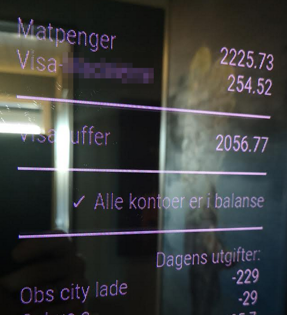

# MMM-Sbanken
Magic Mirror module for displaying transactions and account balance from Sbanken (Norway's first  online bank)

## Dependencies
  * A [MagicMirror<sup>2</sup>](https://github.com/MichMich/MagicMirror) installation
  * API from Sbanken:
     * https://api.sbanken.no/exec.bank/swagger/
     * https://github.com/Sbanken/api-examples
  * In order to get access to these APIs certain requirements needs to be fulfilled:
     * You are a Sbanken customer
     * You have to sign up for access via https://utvikler.sbanken.no
     * You have to enable "Beta" in your personal settings
     * Finally, you need to complete the API Beta setup wizard.
     * From may 2021 you also have to "Grants access to perform operations on APIBeta APIs (aka. developer portal)"

## Installation

In your terminal, go to your MagicMirror's Module folder:
````
cd ~/MagicMirror/modules
````

Clone this repository and install the dependencies:
````
git clone https://github.com/reidarw/MMM-Sbanken.git
````

Add the module to the modules array in the `config/config.js` file
and insert your own info. 

```
{
    module: 'MMM-Sbanken',
    position: 'bottom_left',
    config: {
        clientId: 'yourClientId',
        clientSecret: 'yourClientSecret',
        // Whitcdelist account numbers
        displayOnlyAccounts: [9722XXXXXXX, 9802XXXXXXX],
        aliasForAccountLabels: {9802XXXXXXX: 'VISA-kids', 9722XXXXXXX: 'Food account'},
        // Summation of accounts
        sumAccountsLabel: 'Card buffer',
        sumAccounts: [9713XXXXXXX, 9729XXXXXXX],
        // Custom header
        header: '' 
    }
},
```
**Note:** 
The summation of the accounts can be used to check credit card balance if you have an account 
where you set aside all of the money you have spent on the credit card to avoid paying interest. 

## Optional config
| **Option** | **Description** |
| --- | --- |
| `header` | Alternative header. Set as empty string to remove. Default: "Bankinfo" |
| `minWidth` | Minimum width on container in pixels. Default: 250 |
| `numberOfDecimals` | Number of decimals to be displayed on numbers. Default: 2 |
| `displayOnlyAccounts` | Whitelist account numbers to show the balance |
| `aliasForAccountLabels` | Alias for account names. Example: {9802XXXXXXX: 'VISA-kids', 9722XXXXXXX: 'Food account'} |
| `sumAccountsLabel` | Label for summation of accounts |
| `sumAccounts` | The bank accounts to be summed |
| `payDay` | What date you normally get paid from work. Default: 15 |
| `payDayBufferDays` | How many days you need to transfer money to accounts for different purposes after payday. Default: 4 |
| `showFutureAccountBalance` | Check all accounts against future withdrawals until the next refill of account. Default: true |
| `showTransactionsToday` | View all transactions today. Default: true |
| `showOnlyExpensesInTransactions` | Show only expenses and not income. Default: true |
| `todayTransactionsHeader` | Header for today's transactions . Default: 'Dagens utgifter:' |
| `noTransactionsLabel` | If no transactions on this day, this text will be displayed. Default: 'Ingen utgifter i dag' |
| `salaryAccounts` | Add accounts where you get paid. This will check for payments larger than salaryNotificationMinimumAmount and print "Salary received" and with associated alias for account. Example: [9710XXXXXXX, 9722XXXXXXX] |
| `salaryNotificationMinimumAmount` | Add a minimum amount that can be considered as salary. Default: 10000 |
| `updateInterval` | Interval to update info, in milliseconds. Default: 1 hour |


## Sample screenshot


               